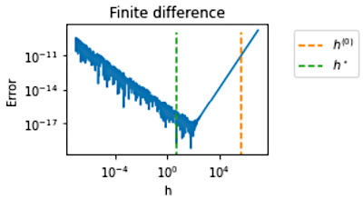

.. numericalderivative documentation master file, created by
   sphinx-quickstart on Mon Feb 14 09:17:40 2022.
   You can adapt this file completely to your liking, but it should at least
   contain the root `toctree` directive.

numericalderivative documentation
=================================

numericalderivative is a module for numerical differentiation.

The goal of this project is to compute the first derivative of a function using finite difference formulas.
The difficulty with these formulas is that it must use a finite difference 
step which must be neither too large (otherwise truncation error dominates 
the error) nor too small (otherwise condition error dominates).
To solve this issue, the module provides algorithms to compute an approximate
optimal finite difference step.

Furthermore, this package provides benchmark problems for numerical
differentiation.

Documentation about numericalderivative can be found `here <https://numericalderivative.readthedocs.io/en/latest/>`_

User documentation
------------------

.. toctree::
   :maxdepth: 3
   
   user_manual/user_manual

Examples 
--------

.. toctree::
   :maxdepth: 2  
   
   examples/examples

References
----------
- Gill, P. E., Murray, W., Saunders, M. A., & Wright, M. H. (1983). Computing forward-difference intervals for numerical optimization. SIAM Journal on Scientific and Statistical Computing, 4(2), 310-321.
- Adaptive numerical differentiation. R. S. Stepleman and N. D. Winarsky. Journal: Math. Comp. 33 (1979), 1257-1264
- Dumontet, J., & Vignes, J. (1977). Détermination du pas optimal dans le calcul des dérivées sur ordinateur. RAIRO. Analyse numérique, 11 (1), 13-25.

Indices and tables
==================

* :ref:`genindex`
* :ref:`search`
